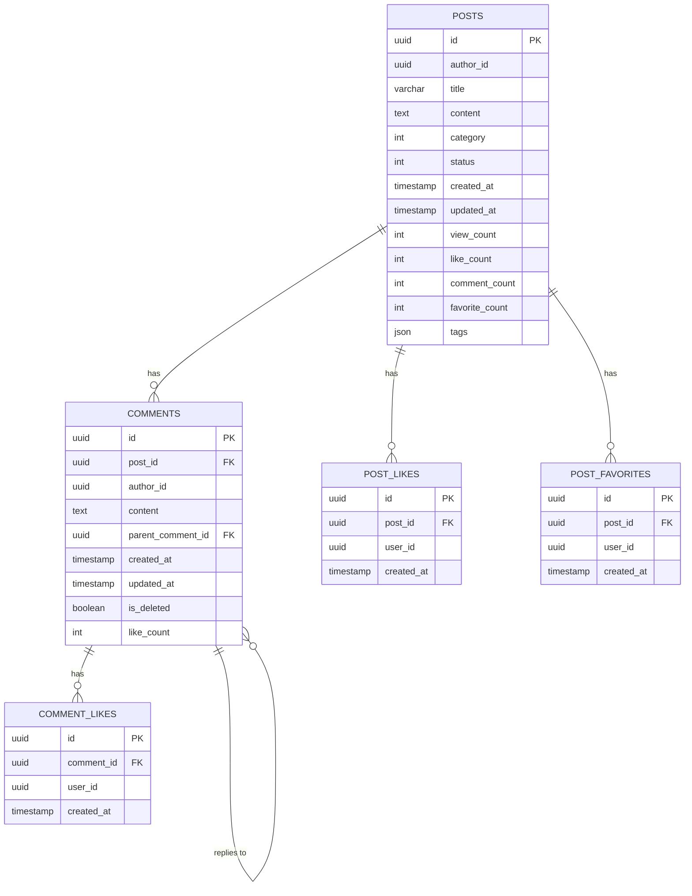

# 论坛管理微服务 - 数据库模型文档

## 概述

本文档详细描述了论坛管理微服务的数据库设计，包括表结构、字段说明、索引配置和关系设计。

**数据库类型**: PostgreSQL  
**ORM框架**: Entity Framework Core  
**设计模式**: DDD (领域驱动设计)  

## 数据库架构图



## 表结构详细说明

### 1. Posts 表 (帖子表)

**表名**: `posts`  
**描述**: 存储论坛帖子的核心信息

| 字段名 | 数据类型 | 约束 | 默认值 | 说明 |
|--------|----------|------|--------|------|
| id | uuid | PRIMARY KEY | - | 帖子唯一标识符 |
| author_id | uuid | NOT NULL | - | 作者用户ID |
| title | varchar(200) | NOT NULL | - | 帖子标题，最大200字符 |
| content | text | NOT NULL | - | 帖子内容，最大10000字符 |
| category | int | NOT NULL | - | 帖子分类 (PostCategory枚举) |
| status | int | NOT NULL | - | 帖子状态 (PostStatus枚举) |
| created_at | timestamp | NOT NULL | CURRENT_TIMESTAMP | 创建时间 |
| updated_at | timestamp | NULL | - | 更新时间 |
| view_count | int | NOT NULL | 0 | 浏览次数 |
| like_count | int | NOT NULL | 0 | 点赞数量 |
| comment_count | int | NOT NULL | 0 | 评论数量 |
| favorite_count | int | NOT NULL | 0 | 收藏数量 |
| tags | json | NULL | - | 标签列表 (JSON数组) |

#### 索引配置
```sql
-- 单列索引
CREATE INDEX idx_posts_author_id ON posts(author_id);
CREATE INDEX idx_posts_category ON posts(category);
CREATE INDEX idx_posts_status ON posts(status);
CREATE INDEX idx_posts_created_at ON posts(created_at);
CREATE INDEX idx_posts_view_count ON posts(view_count);
CREATE INDEX idx_posts_like_count ON posts(like_count);

-- 复合索引
CREATE INDEX idx_posts_category_status ON posts(category, status);
CREATE INDEX idx_posts_author_status ON posts(author_id, status);
CREATE INDEX idx_posts_created_at_desc ON posts(created_at DESC);
```

#### PostCategory 枚举值
| 值 | 名称 | 描述 |
|----|------|------|
| 1 | StudyPartner | 找学习搭子 |
| 2 | SportsTeam | 运动组队 |
| 3 | TechDiscussion | 技术讨论 |
| 4 | LifeSharing | 生活分享 |
| 5 | JobHunting | 求职招聘 |
| 99 | Other | 其他 |

#### PostStatus 枚举值
| 值 | 名称 | 描述 |
|----|------|------|
| 1 | Draft | 草稿 |
| 2 | Published | 已发布 |
| 3 | Deleted | 已删除 |
| 4 | Hidden | 已隐藏 |

### 2. Comments 表 (评论表)

**表名**: `comments`  
**描述**: 存储帖子的评论信息，支持回复功能

| 字段名 | 数据类型 | 约束 | 默认值 | 说明 |
|--------|----------|------|--------|------|
| id | uuid | PRIMARY KEY | - | 评论唯一标识符 |
| post_id | uuid | NOT NULL, FK | - | 所属帖子ID |
| author_id | uuid | NOT NULL | - | 评论作者用户ID |
| content | text | NOT NULL | - | 评论内容，最大2000字符 |
| parent_comment_id | uuid | NULL, FK | - | 父评论ID (用于回复) |
| created_at | timestamp | NOT NULL | CURRENT_TIMESTAMP | 创建时间 |
| updated_at | timestamp | NULL | - | 更新时间 |
| is_deleted | boolean | NOT NULL | false | 是否已删除 (软删除) |
| like_count | int | NOT NULL | 0 | 点赞数量 |

#### 索引配置
```sql
-- 单列索引
CREATE INDEX idx_comments_post_id ON comments(post_id);
CREATE INDEX idx_comments_author_id ON comments(author_id);
CREATE INDEX idx_comments_parent_comment_id ON comments(parent_comment_id);
CREATE INDEX idx_comments_created_at ON comments(created_at);
CREATE INDEX idx_comments_is_deleted ON comments(is_deleted);

-- 复合索引
CREATE INDEX idx_comments_post_created ON comments(post_id, created_at);
CREATE INDEX idx_comments_post_not_deleted ON comments(post_id, is_deleted);
```

#### 外键关系
- `post_id` → `posts.id` (CASCADE DELETE)
- `parent_comment_id` → `comments.id` (SET NULL)

### 3. PostLikes 表 (帖子点赞表)

**表名**: `post_likes`  
**描述**: 存储用户对帖子的点赞记录

| 字段名 | 数据类型 | 约束 | 默认值 | 说明 |
|--------|----------|------|--------|------|
| id | uuid | PRIMARY KEY | - | 点赞记录唯一标识符 |
| post_id | uuid | NOT NULL, FK | - | 被点赞的帖子ID |
| user_id | uuid | NOT NULL | - | 点赞用户ID |
| created_at | timestamp | NOT NULL | CURRENT_TIMESTAMP | 点赞时间 |

#### 索引配置
```sql
-- 单列索引
CREATE INDEX idx_post_likes_post_id ON post_likes(post_id);
CREATE INDEX idx_post_likes_user_id ON post_likes(user_id);

-- 唯一复合索引 (防止重复点赞)
CREATE UNIQUE INDEX idx_post_likes_post_user ON post_likes(post_id, user_id);
```

#### 外键关系
- `post_id` → `posts.id` (CASCADE DELETE)

### 4. PostFavorites 表 (帖子收藏表)

**表名**: `post_favorites`  
**描述**: 存储用户对帖子的收藏记录

| 字段名 | 数据类型 | 约束 | 默认值 | 说明 |
|--------|----------|------|--------|------|
| id | uuid | PRIMARY KEY | - | 收藏记录唯一标识符 |
| post_id | uuid | NOT NULL, FK | - | 被收藏的帖子ID |
| user_id | uuid | NOT NULL | - | 收藏用户ID |
| created_at | timestamp | NOT NULL | CURRENT_TIMESTAMP | 收藏时间 |

#### 索引配置
```sql
-- 单列索引
CREATE INDEX idx_post_favorites_post_id ON post_favorites(post_id);
CREATE INDEX idx_post_favorites_user_id ON post_favorites(user_id);

-- 唯一复合索引 (防止重复收藏)
CREATE UNIQUE INDEX idx_post_favorites_post_user ON post_favorites(post_id, user_id);
```

#### 外键关系
- `post_id` → `posts.id` (CASCADE DELETE)

### 5. CommentLikes 表 (评论点赞表)

**表名**: `comment_likes`  
**描述**: 存储用户对评论的点赞记录

| 字段名 | 数据类型 | 约束 | 默认值 | 说明 |
|--------|----------|------|--------|------|
| id | uuid | PRIMARY KEY | - | 点赞记录唯一标识符 |
| comment_id | uuid | NOT NULL, FK | - | 被点赞的评论ID |
| user_id | uuid | NOT NULL | - | 点赞用户ID |
| created_at | timestamp | NOT NULL | CURRENT_TIMESTAMP | 点赞时间 |

#### 索引配置
```sql
-- 单列索引
CREATE INDEX idx_comment_likes_comment_id ON comment_likes(comment_id);
CREATE INDEX idx_comment_likes_user_id ON comment_likes(user_id);

-- 唯一复合索引 (防止重复点赞)
CREATE UNIQUE INDEX idx_comment_likes_comment_user ON comment_likes(comment_id, user_id);
```

#### 外键关系
- `comment_id` → `comments.id` (CASCADE DELETE)

## 数据库约束和规则

### 1. 数据完整性约束

#### 1.1 外键约束
```sql
-- Posts表外键
ALTER TABLE comments 
ADD CONSTRAINT fk_comments_post_id 
FOREIGN KEY (post_id) REFERENCES posts(id) ON DELETE CASCADE;

ALTER TABLE comments 
ADD CONSTRAINT fk_comments_parent_comment_id 
FOREIGN KEY (parent_comment_id) REFERENCES comments(id) ON DELETE SET NULL;

-- PostLikes表外键
ALTER TABLE post_likes 
ADD CONSTRAINT fk_post_likes_post_id 
FOREIGN KEY (post_id) REFERENCES posts(id) ON DELETE CASCADE;

-- PostFavorites表外键
ALTER TABLE post_favorites 
ADD CONSTRAINT fk_post_favorites_post_id 
FOREIGN KEY (post_id) REFERENCES posts(id) ON DELETE CASCADE;

-- CommentLikes表外键
ALTER TABLE comment_likes 
ADD CONSTRAINT fk_comment_likes_comment_id 
FOREIGN KEY (comment_id) REFERENCES comments(id) ON DELETE CASCADE;
```

#### 1.2 检查约束
```sql
-- 帖子标题长度检查
ALTER TABLE posts ADD CONSTRAINT chk_posts_title_length CHECK (LENGTH(title) >= 1 AND LENGTH(title) <= 200);

-- 帖子内容长度检查
ALTER TABLE posts ADD CONSTRAINT chk_posts_content_length CHECK (LENGTH(content) >= 1 AND LENGTH(content) <= 10000);

-- 评论内容长度检查
ALTER TABLE comments ADD CONSTRAINT chk_comments_content_length CHECK (LENGTH(content) >= 1 AND LENGTH(content) <= 2000);

-- 计数器非负检查
ALTER TABLE posts ADD CONSTRAINT chk_posts_counters_non_negative CHECK (view_count >= 0 AND like_count >= 0 AND comment_count >= 0 AND favorite_count >= 0);

ALTER TABLE comments ADD CONSTRAINT chk_comments_like_count_non_negative CHECK (like_count >= 0);

-- 枚举值检查
ALTER TABLE posts ADD CONSTRAINT chk_posts_category CHECK (category IN (1, 2, 3, 4, 5, 99));
ALTER TABLE posts ADD CONSTRAINT chk_posts_status CHECK (status IN (1, 2, 3, 4));
```

### 2. 业务规则

#### 2.1 软删除规则
- 帖子删除使用状态标记 (`status = 3`)
- 评论删除使用布尔标记 (`is_deleted = true`)
- 查询时需要过滤已删除数据

#### 2.2 计数器同步规则
- 帖子计数器 (`like_count`, `comment_count`, `favorite_count`) 需要与实际关联表数据保持同步
- 评论计数器 (`like_count`) 需要与实际点赞表数据保持同步

#### 2.3 唯一性规则
- 同一用户对同一帖子只能点赞一次
- 同一用户对同一帖子只能收藏一次
- 同一用户对同一评论只能点赞一次

## 性能优化建议

### 1. 查询优化

#### 1.1 分页查询优化
```sql
-- 使用游标分页代替OFFSET
SELECT * FROM posts 
WHERE created_at < '2024-01-01T00:00:00Z' 
ORDER BY created_at DESC 
LIMIT 20;

-- 复合索引支持
CREATE INDEX idx_posts_created_at_status ON posts(created_at DESC, status);
```

#### 1.2 热门帖子查询优化
```sql
-- 热门帖子算法索引
CREATE INDEX idx_posts_hot_score ON posts((view_count * 0.3 + like_count * 0.5 + comment_count * 0.2) DESC);
```

### 2. 缓存策略

#### 2.1 Redis缓存键设计
```
post:{postId}          # 帖子详情缓存 (5分钟)
hot_posts:{count}      # 热门帖子缓存 (10分钟)
user_posts:{userId}:{page} # 用户帖子缓存 (5分钟)
```

#### 2.2 缓存更新策略
- 帖子更新时清除相关缓存
- 使用Redis发布/订阅模式实现缓存失效
- 设置合理的缓存过期时间

### 3. 数据维护

#### 3.1 定期清理任务
```sql
-- 清理已删除的帖子 (30天后物理删除)
DELETE FROM posts 
WHERE status = 3 
AND updated_at < NOW() - INTERVAL '30 days';

-- 清理已删除的评论 (30天后物理删除)
DELETE FROM comments 
WHERE is_deleted = true 
AND updated_at < NOW() - INTERVAL '30 days';
```

#### 3.2 统计信息更新
```sql
-- 更新帖子计数器
UPDATE posts SET 
    like_count = (SELECT COUNT(*) FROM post_likes WHERE post_id = posts.id),
    comment_count = (SELECT COUNT(*) FROM comments WHERE post_id = posts.id AND is_deleted = false),
    favorite_count = (SELECT COUNT(*) FROM post_favorites WHERE post_id = posts.id);

-- 更新评论计数器
UPDATE comments SET 
    like_count = (SELECT COUNT(*) FROM comment_likes WHERE comment_id = comments.id);
```

## 数据迁移脚本

### 1. 初始化脚本
```sql
-- 创建数据库
CREATE DATABASE forum_manager;

-- 创建用户
CREATE USER forum_user WITH PASSWORD 'secure_password';
GRANT ALL PRIVILEGES ON DATABASE forum_manager TO forum_user;

-- 切换到目标数据库
\c forum_manager;

-- 创建UUID扩展
CREATE EXTENSION IF NOT EXISTS "uuid-ossp";
```

### 2. 示例数据插入
```sql
-- 插入测试帖子
INSERT INTO posts (id, author_id, title, content, category, status, created_at, tags)
VALUES 
    (uuid_generate_v4(), uuid_generate_v4(), '欢迎来到论坛', '这是第一个测试帖子', 3, 2, NOW(), '["欢迎", "测试"]'),
    (uuid_generate_v4(), uuid_generate_v4(), '技术讨论', '让我们一起讨论最新的技术趋势', 3, 2, NOW(), '["技术", "讨论"]'),
    (uuid_generate_v4(), uuid_generate_v4(), '找学习搭子', '寻找一起学习的小伙伴', 1, 2, NOW(), '["学习", "搭子"]');

-- 插入测试评论
INSERT INTO comments (id, post_id, author_id, content, created_at)
SELECT 
    uuid_generate_v4(),
    p.id,
    uuid_generate_v4(),
    '这是一个测试评论',
    NOW()
FROM posts p
LIMIT 1;
```

## 监控和统计

### 1. 性能监控查询
```sql
-- 查看最活跃的帖子
SELECT id, title, view_count, like_count, comment_count, 
       (view_count + like_count * 2 + comment_count * 3) as activity_score
FROM posts 
WHERE status = 2 
ORDER BY activity_score DESC 
LIMIT 10;

-- 查看用户活跃度
SELECT author_id, COUNT(*) as post_count, 
       SUM(view_count) as total_views,
       SUM(like_count) as total_likes
FROM posts 
WHERE status = 2 
GROUP BY author_id 
ORDER BY post_count DESC 
LIMIT 10;

-- 查看评论活跃度
SELECT post_id, COUNT(*) as comment_count
FROM comments 
WHERE is_deleted = false 
GROUP BY post_id 
ORDER BY comment_count DESC 
LIMIT 10;
```

### 2. 数据质量检查
```sql
-- 检查计数器一致性
SELECT p.id, p.like_count, COUNT(pl.id) as actual_likes
FROM posts p
LEFT JOIN post_likes pl ON p.id = pl.post_id
GROUP BY p.id, p.like_count
HAVING p.like_count != COUNT(pl.id);

-- 检查孤立评论
SELECT c.id, c.post_id 
FROM comments c
LEFT JOIN posts p ON c.post_id = p.id
WHERE p.id IS NULL;
```

## 备份和恢复

### 1. 备份策略
```bash
# 全量备份
pg_dump -h localhost -U postgres -d forum_manager -f forum_backup_$(date +%Y%m%d_%H%M%S).sql

# 增量备份 (使用WAL)
pg_basebackup -D /backup/location -Ft -z -P
```

### 2. 恢复策略
```bash
# 从备份恢复
psql -h localhost -U postgres -d forum_manager -f forum_backup_20240101_120000.sql

# 从WAL恢复
pg_receivewal -D /backup/wal -h localhost -U postgres
```

---

**注意**: 本文档会随着数据库结构的变化持续更新，请定期查看最新版本。

