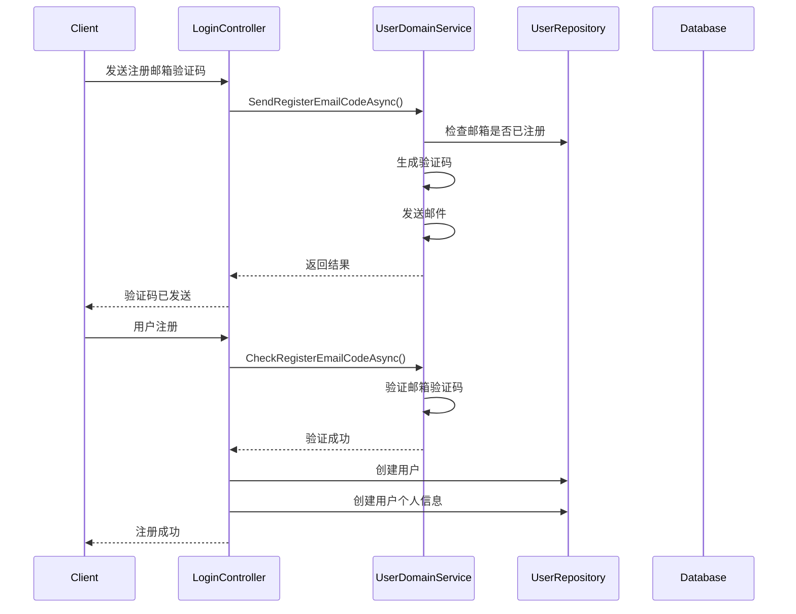
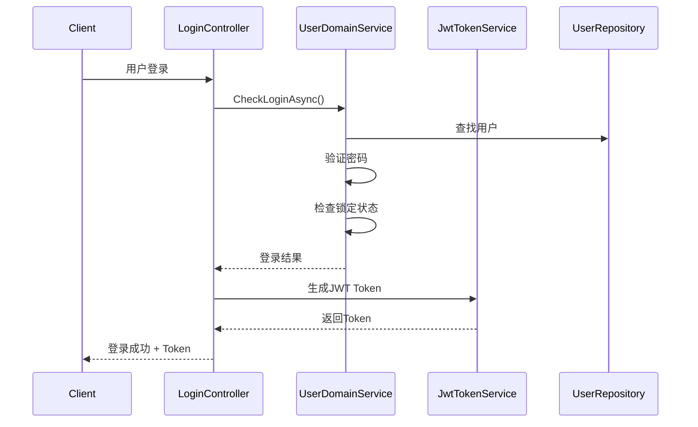
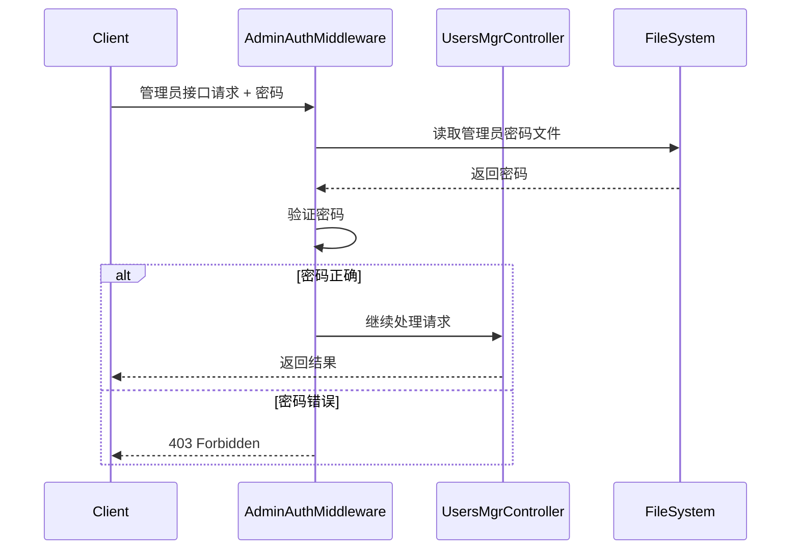
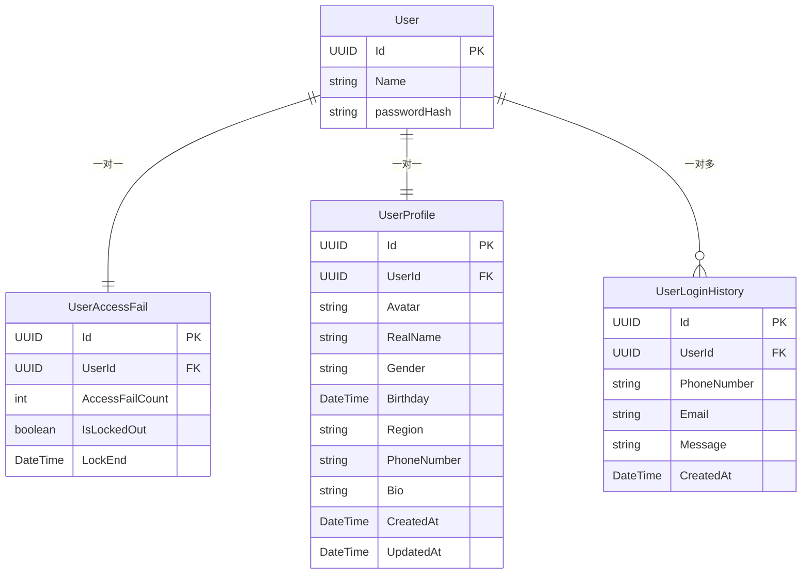

# 用户管理微服务 DDD 架构文档

## 1. 项目概述

### 1.1 微服务简介
用户管理微服务（UserManager）是一个基于DDD（领域驱动设计）架构的微服务，负责用户注册、登录、个人信息管理、权限控制等核心功能。

### 1.2 技术栈
- **框架**: ASP.NET Core 8.0
- **数据库**: PostgreSQL
- **缓存**: Redis
- **ORM**: Entity Framework Core
- **认证**: JWT Token
- **架构模式**: DDD + CQRS + Repository

## 2. DDD 分层架构

### 2.1 整体架构图

```
┌─────────────────────────────────────────────────────────────┐
│                    Presentation Layer                       │
│  ┌─────────────────┐  ┌─────────────────┐  ┌─────────────┐  │
│  │   Controllers   │  │   Middleware    │  │   Services  │  │
│  │                 │  │                 │  │             │  │
│  │ • LoginController│  │ • AdminAuth    │  │ • JwtToken  │  │
│  │ • UsersMgrCtrl  │  │ • UnitOfWork   │  │ • EmailCode │  │
│  └─────────────────┘  └─────────────────┘  └─────────────┘  │
└─────────────────────────────────────────────────────────────┘
                                │
                                ▼
┌─────────────────────────────────────────────────────────────┐
│                    Application Layer                        │
│  ┌─────────────────┐  ┌─────────────────┐  ┌─────────────┐  │
│  │   Domain        │  │   Infrastructure│  │   WebAPI    │  │
│  │   Services      │  │   Services      │  │   Services  │  │
│  │                 │  │                 │  │             │  │
│  │ • UserDomain    │  │ • EmailSender   │  │ • JwtToken  │  │
│  │   Service       │  │ • SmsSender     │  │   Service   │  │
│  │                 │  │ • Cache         │  │             │  │
│  └─────────────────┘  └─────────────────┘  └─────────────┘  │
└─────────────────────────────────────────────────────────────┘
                                │
                                ▼
┌─────────────────────────────────────────────────────────────┐
│                      Domain Layer                           │
│  ┌─────────────────┐  ┌─────────────────┐  ┌─────────────┐  │
│  │    Entities     │  │   Value Objects │  │  Interfaces │  │
│  │                 │  │                 │  │             │  │
│  │ • User          │  │ • UserBasic     │  │ • IUserRepo │  │
│  │ • UserProfile   │  │ • UserAccessFail│  │ • IEmailCode│  │
│  │ • UserLoginHist │  │                 │  │   Sender    │  │
│  └─────────────────┘  └─────────────────┘  └─────────────┘  │
└─────────────────────────────────────────────────────────────┘
                                │
                                ▼
┌─────────────────────────────────────────────────────────────┐
│                  Infrastructure Layer                       │
│  ┌─────────────────┐  ┌─────────────────┐  ┌─────────────┐  │
│  │   Data Access   │  │     Cache       │  │  External   │  │
│  │                 │  │                 │  │  Services   │  │
│  │ • UserDBContext │  │ • RedisCache    │  │ • EmailAPI  │  │
│  │ • Repositories  │  │ • CodeCache     │  │ • SmsAPI    │  │
│  │ • Configurations│  │                 │  │             │  │
│  └─────────────────┘  └─────────────────┘  └─────────────┘  │
└─────────────────────────────────────────────────────────────┘
```

## 3. 项目结构详解

### 3.1 项目分层结构

```
UserManager/
├── UserManager.Domain/                    # 领域层
│   ├── Entities/                          # 实体
│   │   ├── User.cs                        # 用户聚合根
│   │   ├── UserProfile.cs                 # 用户个人信息
│   │   ├── UserAccessFail.cs              # 用户访问失败记录
│   │   └── UserLoginHistory.cs            # 用户登录历史
│   ├── ValueObjects/                      # 值对象
│   │   └── UserBasic.cs                   # 用户基本信息值对象
│   ├── Events/                            # 领域事件
│   │   └── UserAccessResultEvent.cs       # 用户访问结果事件
│   ├── IUserRepository.cs                 # 用户仓储接口
│   ├── IUserProfileRepository.cs          # 用户个人信息仓储接口
│   ├── IEmailCodeSender.cs                # 邮箱验证码发送接口
│   ├── IEmailCodeCache.cs                 # 邮箱验证码缓存接口
│   ├── IPhoneCodeCache.cs                 # 手机验证码缓存接口
│   ├── ISmsCodeSender.cs                  # 短信验证码发送接口
│   ├── UserDomainService.cs               # 用户领域服务
│   ├── UserAccessResult.cs                # 用户访问结果枚举
│   └── CheckCodeResult.cs                 # 验证码检查结果枚举
├── UserManager.Infrastracture/            # 基础设施层
│   ├── Configs/                           # EF Core 配置
│   │   ├── UserConfig.cs                  # 用户实体配置
│   │   ├── UserProfileConfig.cs           # 用户个人信息配置
│   │   ├── UserAccessFailConfig.cs        # 用户访问失败配置
│   │   └── UserLoginHistoryConfig.cs      # 用户登录历史配置
│   ├── Migrations/                        # 数据库迁移
│   ├── UserDBContext.cs                   # 数据库上下文
│   ├── UserRepository.cs                  # 用户仓储实现
│   ├── UserProfileRepository.cs           # 用户个人信息仓储实现
│   ├── EmailCodeSender.cs                 # 邮箱验证码发送实现
│   ├── RedisEmailCodeCache.cs             # Redis邮箱验证码缓存
│   ├── RedisPhoneCodeCache.cs             # Redis手机验证码缓存
│   └── SmsCodeSender.cs                   # 短信验证码发送实现
└── UserManager.WebAPI/                    # 应用层/表现层
    ├── Controllers/                        # 控制器
    │   ├── LoginController.cs              # 登录控制器
    │   ├── UsersMgrController.cs           # 用户管理控制器
    │   └── Requests/                       # 请求模型
    │       ├── RegisterRequest.cs          # 注册请求
    │       ├── LoginRequest.cs             # 登录请求
    │       ├── UpdateUserProfileRequest.cs # 更新个人信息请求
    │       └── LockUserRequest.cs          # 锁定用户请求
    ├── Middleware/                         # 中间件
    │   ├── AdminAuthorizationMiddleware.cs # 管理员权限中间件
    │   └── UnitOfWorkFilter.cs             # 工作单元过滤器
    ├── Services/                           # 应用服务
    │   └── JwtTokenService.cs              # JWT Token服务
    ├── Events/                             # 事件处理器
    │   └── UserAccessResultEventHandler.cs # 用户访问结果事件处理器
    ├── Program.cs                          # 程序入口
    └── appsettings.json                    # 配置文件
```

## 4. DDD 核心概念实现

### 4.1 聚合根（Aggregate Root）

#### User 聚合根
```csharp
public record User : IAggregateRoot
{
    public Guid Id { get; set; }
    public string Name { get; set; }
    public UserBasic UserBasic { get; set; }
    private string? passwordHash;
    public UserAccessFail UserAccessFail { get; private set; }
    
    // 业务方法
    public void ChangePassword(string password);
    public bool CheckPassword(string password);
    public bool HasPassword();
    public void ChangeBasic(UserBasic userBasic);
}
```

**设计原则**：
- 作为聚合根，控制整个用户聚合的完整性
- 封装密码相关的业务逻辑
- 管理用户基本信息和访问失败记录

### 4.2 实体（Entities）

#### UserProfile 实体
```csharp
public record UserProfile : IAggregateRoot
{
    public Guid Id { get; set; }
    public Guid UserId { get; set; }
    public User User { get; set; }
    
    // 个人信息字段
    public string? Avatar { get; set; }        // Base64编码
    public string? RealName { get; set; }
    public string? Gender { get; set; }
    public DateTime? Birthday { get; set; }
    public string? Region { get; set; }
    public string? PhoneNumber { get; set; }
    public string? Bio { get; set; }
    
    // 业务方法
    public void UpdateProfile(...);
}
```

### 4.3 值对象（Value Objects）

#### UserBasic 值对象
```csharp
public record UserBasic
{
    public string? PhoneNumber { get; init; }
    public string? Email { get; init; }
    
    public UserBasic(string? phoneNumber, string? email)
    {
        PhoneNumber = phoneNumber;
        Email = email;
    }
}
```

**设计原则**：
- 不可变性（record类型）
- 无标识符
- 通过构造函数确保有效性

### 4.4 领域服务（Domain Services）

#### UserDomainService
```csharp
public class UserDomainService
{
    private readonly IUserRepository repository;
    private readonly IEmailCodeSender? emailSender;
    private readonly IEmailCodeCache? emailCodeCache;
    
    // 核心业务方法
    public async Task<UserAccessResult> CheckLoginAsync(UserBasic userBasic, string password);
    public async Task<UserAccessResult> SendEmailCodeAsync(string email);
    public async Task<CheckCodeResult> CheckEmailCodeAsync(string email, string code);
    public void ResetAccessFail(User user);
    public bool IsLockOut(User user);
    public void AccessFail(User user);
}
```

**设计原则**：
- 封装复杂的业务逻辑
- 协调多个聚合根
- 处理跨聚合的业务规则

### 4.5 仓储模式（Repository Pattern）

#### 接口定义
```csharp
public interface IUserRepository
{
    Task<User?> FindOneAsync(UserBasic userBasic);
    Task<User?> FindOneAsync(Guid id);
    Task AddNewLoginHistoryAsync(UserBasic userBasic, string message);
    Task PublishEventAsync<T>(T domainEvent) where T : INotification;
}
```

#### 实现
```csharp
public class UserRepository : IUserRepository
{
    private readonly UserDBContext _dbContext;
    private readonly IMediator _mediator;
    
    // 实现具体的数据库操作
}
```

## 5. 核心业务流程

### 5.1 用户注册流程



### 5.2 用户登录流程



### 5.3 管理员权限验证流程



## 6. 数据模型设计

### 6.1 数据库表结构

```sql
-- 用户表
CREATE TABLE T_Users (
    Id UUID PRIMARY KEY,
    Name VARCHAR(255) NOT NULL,
    passwordHash VARCHAR(100),
    PhoneNumber VARCHAR(20),
    Email VARCHAR(100)
);

-- 用户个人信息表
CREATE TABLE T_UserProfiles (
    Id UUID PRIMARY KEY,
    UserId UUID NOT NULL REFERENCES T_Users(Id),
    Avatar TEXT,                    -- Base64编码
    RealName VARCHAR(50),
    Gender VARCHAR(10),
    Birthday TIMESTAMP,
    Region VARCHAR(100),
    PhoneNumber VARCHAR(20),
    Bio TEXT,
    CreatedAt TIMESTAMP NOT NULL,
    UpdatedAt TIMESTAMP NOT NULL
);

-- 用户访问失败表
CREATE TABLE T_UserAccessFails (
    Id UUID PRIMARY KEY,
    UserId UUID NOT NULL REFERENCES T_Users(Id),
    AccessFailCount INTEGER NOT NULL,
    IsLockedOut BOOLEAN NOT NULL,
    LockEnd TIMESTAMP
);

-- 用户登录历史表
CREATE TABLE T_UserLoginHistories (
    Id UUID PRIMARY KEY,
    UserId UUID REFERENCES T_Users(Id),
    PhoneNumber VARCHAR(20),
    Email VARCHAR(100),
    Message TEXT,
    CreatedAt TIMESTAMP NOT NULL
);
```

### 6.2 实体关系图



## 7. 配置管理

### 7.1 配置文件结构

```json
{
  "ConnectionStrings": {
    "DefaultConnection": "Host=localhost;Port=5432;Database=usermanagerdb;Username=postgres;Password=xxx;",
    "Redis": "localhost"
  },
  "Email": {
    "SmtpHost": "smtp.qq.com",
    "SmtpPort": "587",
    "SenderEmail": "xxx@qq.com",
    "SenderPassword": "xxx",
    "SenderName": "TeamUp官方"
  },
  "Jwt": {
    "SecretKey": "SuperSecretKeyForJWTTokenGeneration7777777",
    "Issuer": "UserManagerAPI",
    "Audience": "UserManagerClient",
    "ExpirationInMinutes": 60
  },
  "AdminPassword": {
    "FilePath": "admin_password.txt"
  }
}
```

## 8. 安全设计

### 8.1 认证与授权

1. **JWT Token认证**
   - 用户登录后获得JWT Token
   - Token包含用户ID、角色等信息
   - 支持Token过期和刷新

2. **管理员权限控制**
   - 通过文件中的密码进行验证
   - 中间件级别的权限检查
   - 支持动态修改管理员密码

3. **密码安全**
   - 密码使用MD5哈希存储
   - 支持密码复杂度验证
   - 登录失败锁定机制

### 8.2 数据安全

1. **敏感信息保护**
   - 密码不存储明文
   - 个人信息字段支持加密
   - 头像使用Base64编码

2. **访问控制**
   - 用户只能访问自己的信息
   - 管理员接口需要特殊权限
   - 操作日志记录

## 9. 扩展性设计

### 9.1 微服务通信

- 通过HTTP API进行服务间通信
- 支持服务发现和负载均衡
- 事件驱动的异步通信

### 9.2 数据一致性

- 使用工作单元模式确保事务一致性
- 支持分布式事务（如需要）
- 事件溯源模式（可扩展）

### 9.3 性能优化

- Redis缓存提升性能
- 数据库索引优化
- 异步处理非关键业务

## 10. 部署架构

### 10.1 容器化部署

```yaml
# docker-compose.yml
version: '3.8'
services:
  usermanager-api:
    build: ./UserManager.WebAPI
    ports:
      - "9291:9291"
    environment:
      - ConnectionStrings__DefaultConnection=Host=postgres;Port=5432;Database=usermanagerdb;Username=postgres;Password=xxx;
      - ConnectionStrings__Redis=redis:6379
    depends_on:
      - postgres
      - redis
  
  postgres:
    image: postgres:15
    environment:
      POSTGRES_DB: usermanagerdb
      POSTGRES_USER: postgres
      POSTGRES_PASSWORD: xxx
    volumes:
      - postgres_data:/var/lib/postgresql/data
  
  redis:
    image: redis:7-alpine
    ports:
      - "6379:6379"
```

### 10.2 监控与日志

- 结构化日志记录
- 健康检查端点
- 性能指标监控
- 错误追踪和告警

## 11. 开发规范

### 11.1 代码规范

1. **命名规范**
   - 实体使用名词：User, UserProfile
   - 服务使用动词+名词：UserDomainService
   - 接口以I开头：IUserRepository

2. **分层规范**
   - 领域层不依赖其他层
   - 基础设施层实现领域层接口
   - 应用层协调领域层和基础设施层

3. **异常处理**
   - 使用领域异常表示业务错误
   - 统一异常处理中间件
   - 记录详细的错误日志

### 11.2 测试策略

1. **单元测试**
   - 领域服务测试
   - 实体业务逻辑测试
   - 仓储接口测试

2. **集成测试**
   - API接口测试
   - 数据库集成测试
   - 外部服务集成测试

3. **端到端测试**
   - 完整业务流程测试
   - 用户场景测试

## 12. 总结

这个用户管理微服务采用了标准的DDD架构模式，具有以下特点：

1. **清晰的层次分离**：领域层、应用层、基础设施层职责明确
2. **高内聚低耦合**：每个模块职责单一，依赖关系清晰
3. **可扩展性强**：支持水平扩展和功能扩展
4. **安全性好**：多层安全防护机制
5. **可维护性高**：代码结构清晰，易于理解和修改

通过这个架构，开发者可以更好地理解DDD的核心概念和实现方式，为构建更复杂的微服务系统打下坚实基础。
